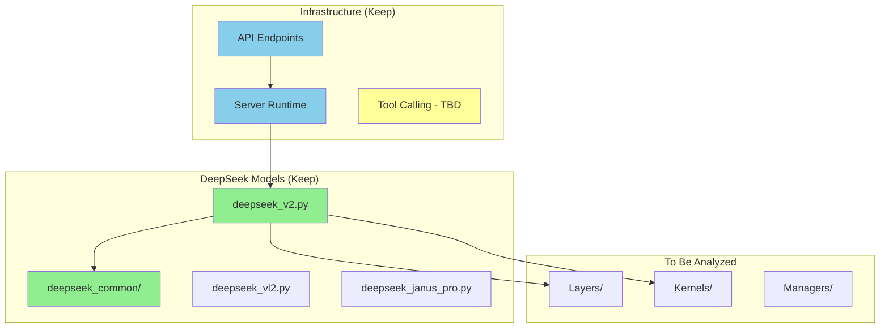

# DeepSeek Dependency Graph

**Last Updated:** 2026-01-11
**Status:** Initial setup - Round 1

## Overview
This document tracks the dependency graph for DeepSeek models in SGLang. It is updated iteratively as we analyze the codebase.

## Legend
- 🟢 **Green (Keep):** DeepSeek models and confirmed dependencies
- 🔵 **Blue (Keep):** Required infrastructure (API, server, runtime)
- 🟡 **Yellow (Uncertain):** Needs analysis or user confirmation
- 🔴 **Red (Remove):** Provably unused by DeepSeek models

## Important Note
**Tool Calling Functionality:** Must be preserved! Location TBD (needs investigation).

---

## Round 1: Initial Survey (2026-01-11)

### DeepSeek Models - TEXT-ONLY R1 (🟢 Keep)
**USER DECISION:** Keep text-only DeepSeek R1 models only

```
sglang/python/sglang/srt/models/
├── deepseek.py          ✅ Text-only base model
├── deepseek_v2.py       ✅ Text-only v2/R1 (PRIMARY for DeepSeek-R1)
├── deepseek_nextn.py    ✅ Text-only variant
└── deepseek_common/     ✅ Shared MLA, MoE components
```

### DeepSeek Models - MULTIMODAL (🔴 Remove)
```
sglang/python/sglang/srt/models/
├── deepseek_janus_pro.py  ❌ Multimodal variant (not needed)
├── deepseek_ocr.py         ❌ OCR variant (not needed)
└── deepseek_vl2.py         ❌ Vision-Language variant (not needed)
```

### Status: Ready to begin removals

---

## Dependency Graph (Mermaid)

### High-Level Overview


---

## Next Steps
1. Survey all model files in `sglang/python/sglang/srt/models/`
2. Identify non-DeepSeek models (safe to remove)
3. Locate tool calling functionality
4. Create initial keep/remove lists
